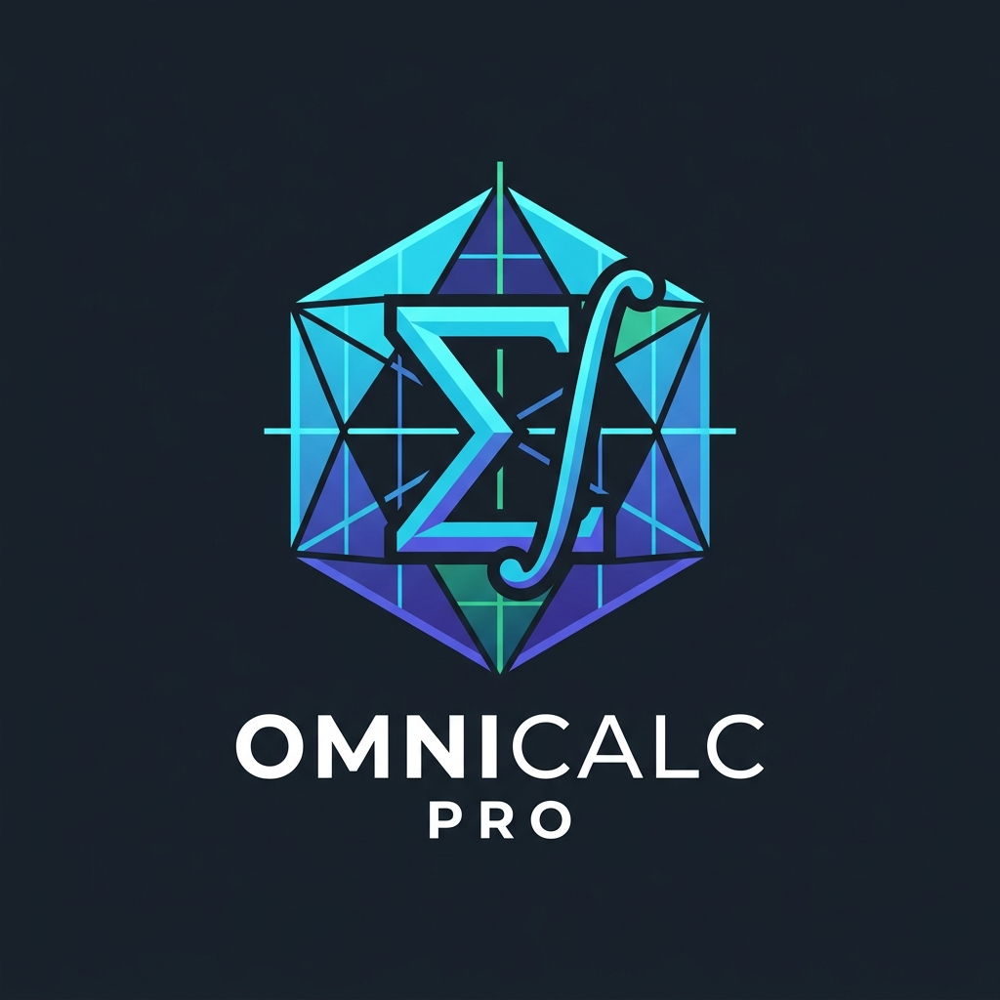

<p align="center">
  
</p>

# OmniCalc Pro 🧮

**An advanced, multi-paradigm calculation suite featuring 21 specialized mathematical engines, interactive data visualizers, AST-safe symbolic evaluation, and modern dual Web & Desktop interfaces.**

[](https://github.com/nishanth-kkj9/OmniCalc-Pro/actions/workflows/ci.yml)
[](VERSION)
[](https://www.typescriptlang.org/)
[](https://react.dev/)
[](https://tailwindcss.com/)
[](https://www.python.org/)
[](https://pypi.org/project/PySide6/)
[](LICENSE)

---

## 🌟 Overview

**OmniCalc Pro** bridges everyday arithmetic, scientific exploration, computational linear algebra, statistical modeling, engineering analysis, and practical daily utility tools. Delivered as a high-performance dual-target suite:

1. **Interactive Web Application**: Built with React 19, TypeScript 5.8, Tailwind CSS v4, Lucide icons, Recharts, and MathJS with dynamic bundle code-splitting, Web Audio tactile haptic feedback, and Light, Dark Slate, and OLED True Black themes.
2. **Native Desktop Suite**: Built with Python 3.10+ and PySide6 featuring responsive layouts, SQLite history caching, and AST-safe symbolic mathematics powered by SymPy.

---

## 🏛️ Architecture Overview

OmniCalc Pro employs a **parallel dual-UI monorepo architecture**, enabling deployment either as a native cross-platform desktop application or as a client-side web application containerized with Nginx.

```
                   ┌────────────────────────────────────────┐
                   │             OmniCalc Pro               │
                   │    (Canonical Version: 2.1.0)          │
                   └──────────────────┬─────────────────────┘
                                      │
               ┌──────────────────────┴──────────────────────┐
               ▼                                             ▼
┌─────────────────────────────┐               ┌─────────────────────────────┐
│    Desktop Application      │               │       Web Application       │
│      (Python + PySide6)     │               │     (React + TypeScript)    │
├─────────────────────────────┤               ├─────────────────────────────┤
│ • Entry: main.py            │               │ • Entry: src/main.tsx       │
│ • UI: ui/ (Lazy Stacked UI) │               │ • UI: src/components/ (Lazy)│
│ • Engines: core/            │               │ • Engines: src/utils/       │
│ • Safe Evaluator: SymPy AST │               │ • Evaluator: MathJS + TS    │
│ • Persistence: SQLite DB    │               │ • Persistence: LocalStorage │
│ • Deploy: PyInstaller/Wheel │               │ • Deploy: Docker Nginx/Vite │
└─────────────────────────────┘               └─────────────────────────────┘
```

- **Shared Domain Capabilities**: Both targets implement identical mathematical domains across all 21 specialized engines.
- **Independent Runtime Targets**:
  - The **Desktop suite** is optimized for low-latency native desktop workflows, offline local SQLite persistence, and heavy symbolic calculus via SymPy.
  - The **Web suite** is optimized for instant zero-install browser access, responsive mobile/desktop layouts, procedural Web Audio synthesizer clicks, and static Docker/CDN distribution.

---

## ⚡ Mathematical & Calculation Engines

| Category | Engine | Capabilities |
|---|---|---|
| **Core & Math** | **Basic Calculator** | Arithmetic (`+`, `-`, `×`, `÷`), parentheses, percentage conversion, sign toggle (`±`), and memory bank (`M+`, `M-`, `MR`, `MC`). |
| | **Scientific Calculator** | 4-state dynamic trigonometric & hyperbolic system (`sin`, `cos`, `tan`, `sin⁻¹`, `cos⁻¹`, `tan⁻¹`, `sinh`, `cosh`, `tanh`, `sinh⁻¹`, `cosh⁻¹`, `tanh⁻¹`), multi-angle modes (**DEG**, **RAD**, **GRAD**) with asymptotic handling and exact zero-crossing stabilization (`cos(90°)` = `0`, `sin(180°)` = `0`), logarithms (`ln`, `log10`, `log2`), powers (`xʸ`, `x²`, `2ˣ`, `10ˣ`, `eˣ`, `√x`, `∛x`), combinatorics (`nCr`, `nPr`) with strict non-negative integer domain validation, modular arithmetic (infix `8 mod 3` and functional `mod(a, b)`), constants (`π`, `e`, `τ`, `φ`), comma delimiter (`,`), parenthesis auto-completion upon evaluation, non-intrusive live preview, memory registers, and operator chaining. |
| | **Fractions & Number Theory** | Exact rational arithmetic (`a/b ± c/d`), auto-simplification, GCD / LCM decomposition tree, prime factorization, and decimal-to-fraction conversions. |
| | **Geometry & Coordinate Engine** | Complete triangle solver (SSS, SAS, ASA, AAS, SSA), 2D line analyzer (distance, slope, midpoint, line equation), 2D/3D vector operations (dot/cross products, projections), and polygon geometry. |
| | **Complex Numbers & Phasor Engine** | Rectangular ($a + bi$), Polar ($r\angle\theta$), Euler ($re^{i\theta}$), $n$-th roots of unity, AC RLC impedance ($\omega L, 1/\omega C$), and phasor addition. |
| **Advanced & Science** | **Equation & System Solver** | Linear equation solver, Quadratic ($ax^2 + bx + c = 0$) with discriminant breakdown, Cubic solver, and $2\times2$ / $3\times3$ Linear System Solver via Cramer's Rule. |
| | **Calculus & Numerical Suite** | Numerical integration using Simpson's Composite Rule ($\int_a^b f(x)dx$), tangent line derivative calculator ($f'(x_0)$), and Newton-Raphson root finder. |
| | **Graphing Calculator** | Multi-function plotting (up to 5 simultaneous functions), adaptive coordinate bounds, dynamic zoom/pan, hover coordinate tracker, table of values, and PNG image export. |
| | **Matrix Calculator** | Matrix arithmetic, determinant, Gauss-Jordan inverse, transpose, trace, rank, nullity, RREF, matrix powers $A^n$, scalar multiplication, and exact eigenvalues. |
| | **Statistics & Data Analysis** | Descriptive stats: Mean, Median, Mode, Sample/Population Variance, Standard Deviation, IQR, Range, Sum, Min/Max, and single-value Z-Score computation. |
| | **Regression & Curve Fitting** | Linear, Polynomial (degree 2–5), Exponential, Power, and Logarithmic regression with ANOVA ($R^2$, Adjusted $R^2$, RMSE, $F$-statistic), residuals table, and inverse prediction. |
| | **Probability Distributions** | Continuous and discrete distributions: Normal, Binomial, Poisson, Student's $t$, Chi-Square, and Exponential with PDF/PMF, CDF, quantiles, and moments. |
| | **Statistical Inference** | Hypothesis testing: 1-Sample Z-Test, 1-Sample T-Test, 2-Sample Independent T-Test, Paired T-Test, 1-Proportion Z-Test, Chi-Square Goodness of Fit, and One-Way ANOVA with $p$-values, test statistics, and rejection decisions. |
| | **Sequences & Series Analysis** | Arithmetic, Geometric, Fibonacci, and Harmonic series with closed-form $n$-th term formulas, partial sums $S_n$, limit approximations, and ratio convergence tests. |
| | **Programmer Calculator** | Live radix conversions (**HEX**, **DEC**, **OCT**, **BIN**), bit width toggles (64-bit, 32-bit, 16-bit, 8-bit), Bitwise logic (`AND`, `OR`, `XOR`, `NOT`, `NAND`, `NOR`), bit-shifts (`LSH`, `RSH`), and 2's complement. |
| **Practical & Life** | **Unit Converter & Physical Units** | 8 standard categories + comprehensive dimensional physical units engine (Length, Mass, Temp, Time, Energy, Force, Power, Pressure, Electricity, etc.). |
| | **Finance & Loan EMI** | Mortgage & Car Loan amortization scheduler, Compound Interest (FD/SIP wealth builder), GST / Sales Tax calculator, and percentage Discount/Markup. |
| | **Date & Time Calculator** | Date span/duration, Business working days (excluding custom weekends/holidays), Target event countdown, and hourly work shift wage logger. |
| | **Health & Fitness Suite** | Body Mass Index (BMI) with category visualizer, Basal Metabolic Rate (BMR: Harris-Benedict & Mifflin-St Jeor), Total Daily Energy Expenditure (TDEE), and Karvonen Target Heart Rate training zones. |
| **Tools & Reference** | **Formulas & Constants** | Curated catalog of fundamental physical constants ($c, G, h, k_B, e, m_e, N_A$) and interactive cheat sheet for algebra, trigonometry, calculus, and geometry identities. |
| | **Calculation History** | Searchable audit trail with engine tags, timestamps, copy expression/result buttons, and one-click JSON / CSV data export. |
| | **Preferences & Settings** | Custom themes (Dark Slate, Light, OLED True Black), 6 accent color presets, synthesized mechanical audio feedback, precision controls (2–12 decimals), and default angle units. |

---

## 🎨 UI/UX Features

- **Command Palette (`Ctrl+K` / `⌘K`)**: Instant search and navigation across all 21 engines, formula cheat sheets, quick theme switches, and audio controls.
- **Dynamic Theming**:
  - **Light Theme**: High-contrast, clean slate aesthetic optimized for daylight visibility.
  - **Dark Slate Theme**: Deep eye-safe twilight navy palette.
  - **OLED True Black Theme**: Pure black (`#000000`) for OLED power efficiency.
  - **Accent Colors**: Sky Blue, Emerald Teal, Violet Indigo, Amber Gold, Rose Pink, and Cyan Teal.
- **Audio Synthesizer & Haptics**: Built-in Web Audio API synthesizer for tactile mechanical keypress feedback with zero external asset latency.
- **Responsive Layout**: Fluid desktop sidebar with collapsible mobile drawers, responsive quick-switch pills, and touch-optimized keypad targets.
- **One-Click Copy & Export**: Dedicated copy buttons on digital displays and comprehensive CSV/JSON history logs.

---

## 🚀 Quick Start

### 🌐 1. Web Application (React 19 + Vite + TypeScript)

#### Prerequisites
- Node.js 22.x+ (see `.nvmrc`)
- npm or bun

#### Setup & Development
```bash
# Clone the repository
git clone https://github.com/nishanth-kkj9/OmniCalc-Pro.git
cd OmniCalc-Pro

# Install exact dependencies using the committed lockfile
npm ci

# Start the development server
npm run dev
```

Visit `http://localhost:3000` to interact with the application.

#### Tests, Linting & Production Build
```bash
# Run full Vitest test suite (280+ tests across 25 test suites)
npm test

# Run tests with coverage reporting
npm run coverage

# Run ESLint validation
npm run lint

# Format code with Prettier
npm run format

# Typecheck and build production bundle
npm run build
```

#### Docker Deployment
Docker builds and containerizes the static web application with hardened Nginx on port 3000 running as a non-root user with immutable image digests:
```bash
# Build and run containerized web app
docker build -t omnicalc-pro .
docker run -p 3000:3000 omnicalc-pro
```

---

### 🖥️ 2. Desktop Application (Python + PySide6)

#### Prerequisites
- Python 3.10+ (see `.python-version`)
- Windows 10/11, macOS, or Linux

#### Installation & Launch
```bash
# Set up a virtual environment
python -m venv venv
source venv/bin/activate  # On Windows: venv\Scripts\activate

# Install runtime dependencies
pip install -r requirements.txt

# Launch the desktop app via root entry point
python main.py
```

#### Development, Testing & Code Quality
```bash
# Install development dependencies
pip install -e ".[dev]"

# Run full pytest suite
pytest tests/ -v --tb=short

# Run Ruff linter
ruff check .

# Static type check
mypy core/ utils/
```

#### Standalone PyInstaller Binary
```bash
pip install pyinstaller
pyinstaller --onefile --windowed --name=OmniCalc-Pro main.py
```
The compiled executable will be written to `dist/`.

---

## ⌨️ Keyboard Shortcuts Reference

| Shortcut | Action | Scope |
|---|---|---|
| `Ctrl+K` / `Cmd+K` | Open Command Palette & Quick Jump | Global (Web & Desktop) |
| `0` – `9`, `.` | Enter Digits and Decimal point | Calculators |
| `,` | Enter Function Argument Delimiter | Scientific / Multi-arg functions |
| `+`, `-`, `*`, `/` | Arithmetic Operators (`+`, `−`, `×`, `÷`) | Calculators |
| `Enter` / `=` | Calculate & Evaluate Expression | Calculators |
| `Backspace` / `Delete` | Delete last token / character | Calculators |
| `Escape` / `C` | Clear active expression / Close palette | Calculators / Modals |
| `(` / `)` | Open / Close Parentheses | Calculators |
| `^` | Exponentiation ($x^y$) | Scientific & Calculus |
| `p` / `P` | Insert Pi constant ($\pi$) | Scientific Calculator |
| `e` / `E` | Insert Euler's constant ($e$) | Scientific Calculator |
| `Ctrl+T` | Toggle Color Theme | Global |
| `Ctrl+Z` | Undo last edit action | Scientific / Inputs |
| `Ctrl+C` | Copy Active Result to Clipboard | Global |

---

## 📂 Project Architecture

```
OmniCalc-Pro/
├── .github/
│   ├── workflows/
│   │   ├── ci.yml              # CI (Web lint/test/build + Python matrix tests/lint)
│   │   ├── codeql.yml          # CodeQL security analysis
│   │   └── release.yml         # GitHub automated release on tag
│   ├── ISSUE_TEMPLATE/         # GitHub issue templates (bug report, feature request)
│   └── PULL_REQUEST_TEMPLATE.md# Pull request template
├── assets/                     # Static media & branding assets
│   ├── logo.png                # OmniCalc Pro high-resolution suite logo
│   ├── icons/                  # SVG and PNG app icons & category glyphs
│   └── themes/                 # Visual theme presets
├── public/                     # Static web assets served at root
│   └── assets/                 # Icons, logo, and favicon assets
├── src/                        # Web Application (React 19 + TypeScript + Tailwind v4)
│   ├── assets/                 # Bundled visual assets & logo
│   ├── components/             # 21 Calculation modules & UI components (Code-split)
│   │   ├── BasicCalculator.tsx
│   │   ├── ScientificCalculator.tsx
│   │   ├── FractionsCalculator.tsx
│   │   ├── GeometryCalculator.tsx
│   │   ├── ComplexCalculator.tsx
│   │   ├── EquationSolver.tsx
│   │   ├── CalculusCalculator.tsx
│   │   ├── GraphingCalculator.tsx
│   │   ├── MatrixCalculator.tsx
│   │   ├── StatisticsCalculator.tsx
│   │   ├── RegressionCalculator.tsx
│   │   ├── DistributionsCalculator.tsx
│   │   ├── InferenceCalculator.tsx
│   │   ├── SequencesCalculator.tsx
│   │   ├── ProgrammerCalculator.tsx
│   │   ├── ConverterCalculator.tsx
│   │   ├── PhysicalUnitsCalculator.tsx
│   │   ├── FinanceCalculator.tsx
│   │   ├── DateTimeCalculator.tsx
│   │   ├── HealthCalculator.tsx
│   │   ├── FormulasPanel.tsx
│   │   ├── HistoryPanel.tsx
│   │   ├── SettingsModal.tsx
│   │   ├── CommandPalette.tsx
│   │   ├── Header.tsx
│   │   └── Sidebar.tsx
│   ├── utils/                  # Core calculation & formatting helpers
│   │   ├── calculator.ts       # Expression parser & MathJS evaluator (EvalResult)
│   │   ├── calculator.test.ts  # Vitest unit test suite
│   │   ├── formatting.ts       # Number formatting, SI suffixes, theme tokens
│   │   ├── formatting.test.ts  # Vitest formatting test suite
│   │   ├── history.ts          # Local storage history persistence
│   │   ├── history.test.ts     # Vitest history test suite
│   │   └── sound.ts            # Web Audio API procedural sound synthesizer
│   ├── test/                   # Test configuration and setup
│   │   └── setup.ts
│   ├── types.ts                # TypeScript types & interfaces
│   ├── App.tsx                 # Root application component (Code-split with Suspense)
│   └── main.tsx                # Client entry point
├── core/                       # Desktop Engine Modules (Python)
├── ui/                         # Desktop UI Components (PySide6)
├── utils/                      # Desktop Python utility modules
├── tests/                      # Python Test Suite
├── main.py                     # Desktop Application Root Entry Point
├── Dockerfile                  # Multi-stage production container image
├── VERSION                     # Single source of truth version file (2.1.0)
├── package.json                # Web NPM dependencies & scripts
├── pyproject.toml              # Python project metadata & modern ruff/mypy tool config
└── requirements.txt            # Python dependencies
```

---

## 📄 License

This project is licensed under the **MIT License** — see the [LICENSE](LICENSE) file for details.
